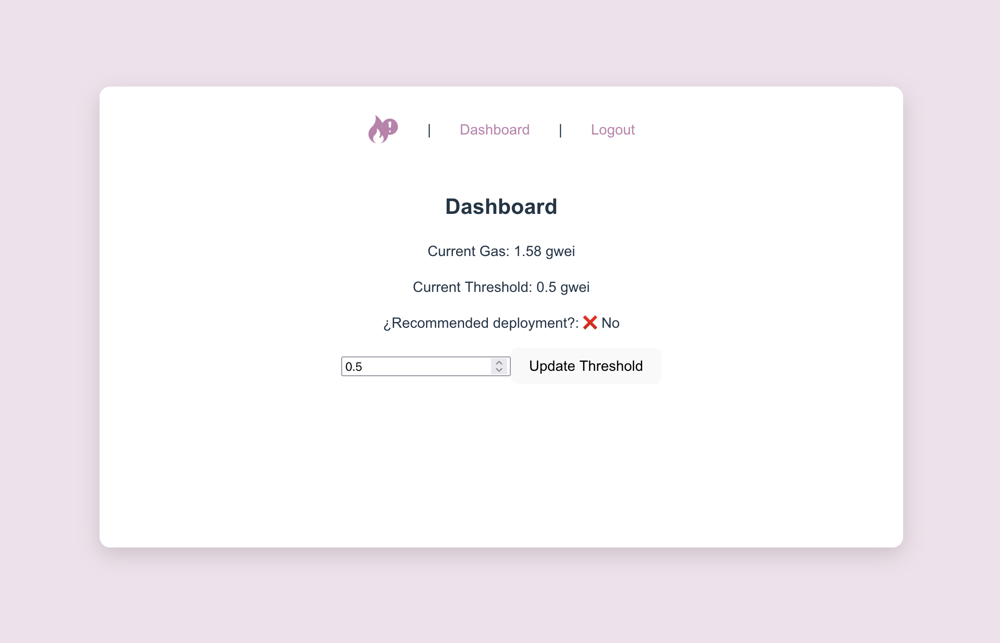

# ⛽ Gas Fee Detector

A small tool that monitors Ethereum gas fees in real time and notifies users when the fees drop below a their defined threshold.

## 🧠 Purpose

This project demonstrates backend skills:

- RESTful API design with Node.js & Express
- User authentication using JWT
- MongoDB integration via Mongoose
- Email verification with Nodemailer
- Background jobs (gas fee monitoring)
- CORS management and deployment on Railway + Vercel

## 🚀 [Live Demo](https://gasfee-nu.vercel.app)

---

## 🛠️ Tech Stack

### Backend
- Node.js
- Express.js
- MongoDB + Mongoose
- JWT authentication
- Bcrypt for password hashing
- Nodemailer (SMTP email verification)
- dotenv for environment configuration

### Frontend
- React (Vite)
- LocalStorage for token management
- Fetch API with Bearer token authentication

---

## 🔐 Features

- ✅ User registration with email verification
- ✅ Login with JWT and password encryption
- ✅ Private dashboard protected by token
- ✅ Fetches live gas prices from [Etherscan API](https://docs.etherscan.io/)
- ✅ Set a personal gas threshold (in Gwei)
- ✅ Periodic job checks gas price and sends notification (in progress)

